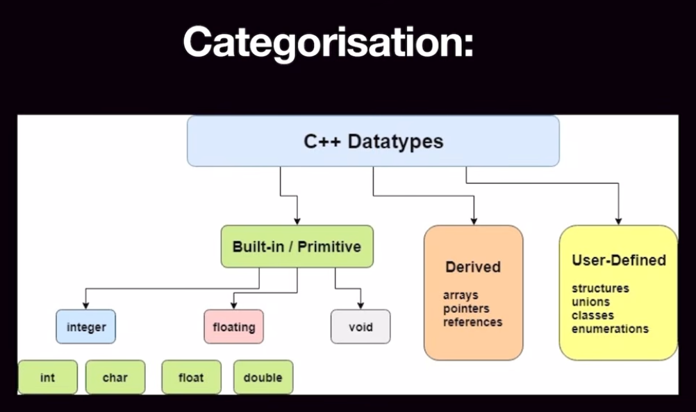
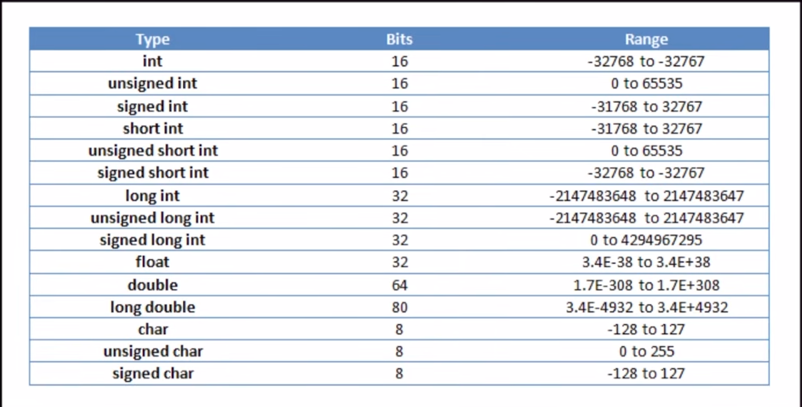

# Hello World First Code
This is area is know as the main scope when we run the cpp code it start this piece of code firstly and {} defines the scope of that particular function name
```c++

#include<iostream>
//header file -> give functionality for input output and standard library
using namespace std;
// standard library -> i wanted to use standard library using namespace std and it consist of cout and many other function like cin, end

int main(){
 // this function executes firstly then after anything other than this executes

 cout << "Hello World" << endl;
 // it means to print Hello world
 // endl means to place the cursor on the new line


 return 0; this means successfull execution 
 // and if this return non zero that means unsuccessfull execution
}
```

## -> PreProcessor Directive
- A Preprocessor directive in cpp is a command that instructs the preprocessor to modify the raw souce code before actual compilation
- Characterstics
    - Run First: The preprocessor scans your file, executes the directives and generates an expanded intermediate text file.
    - Text Substitution: Direcctives physically alter, add, or strip text from your raw code before handling it over to the compiler.
    - Line-Based: A directive spans a single line unless explicityly continued onto the next line using a backslash.

#### How It Works in the Build Pipeline
```
[Your Source Code] -> [Preprocessor Handles # Directives] -> [Expanded Clean Code] -> [Compiler]

```

#### Commonly Used Directives
| Directive | Purpose            | Example                     |
|-----------| ------------------ | ----------------------------|
| #include  | Copies and pastes the contents of a header file into the current file. | #include<-iostream> |
| #deine    | Creates a macro or symbolic constant by replacing text thorughout the code.       | #define PI 3.14


________________________________________
# Variables

#### DataType: 
- The datatype specifies the size and type of information the variable will store. 

#### Declaration: 
- It means when i have declared any variable so then the value which exist in that variable is known as a garbage value.

#### Definition: 
- It means while declaring the variable we are assigning a value to it also.

#### Manipulation or Updation: 
- It means we are modifying the pre existing value in the variable

```cpp
#include<iostream>
#include <iomanip> // We need to use this library if we want to use setprecision fn
using namespace std;

int main(){
    // datatype -> int, long, long long, float, double, string, char, bool etc
    int count = 5;
    float share = 3.14;
    char alphabet = 'A'; // only single quote should be there
    double weight = 55.69887; // it prints 55.6989 because cout has a default printing limit of 6 digits total.
    // Fix for this -> Tell cout to fix the decimal and show 5 decimal places
    cout << fixed << setprecision(5) << weight << "\n"; 
    bool isMale = true;
    bool isChild = 1;

    int x; // it means declaration and it will consist of garbage value

    int y = 19; // it means definition because we are providing a value at the same time

    y=25; // it means manipulation or updation

    // one more thing that is very important is in a particular scope we can not redefine any datatype with the same variable name
    return 0;
}
```




#### Range of int 
- unsigned -> if there are n no. of bits then the formula is 0, 2^n-1 -> 0 to 4294967295
- signed -> if there are n no. of bits then the formula is -2^(n-1), 2^(n-1)-1 -> -2147483648 to 2147483647